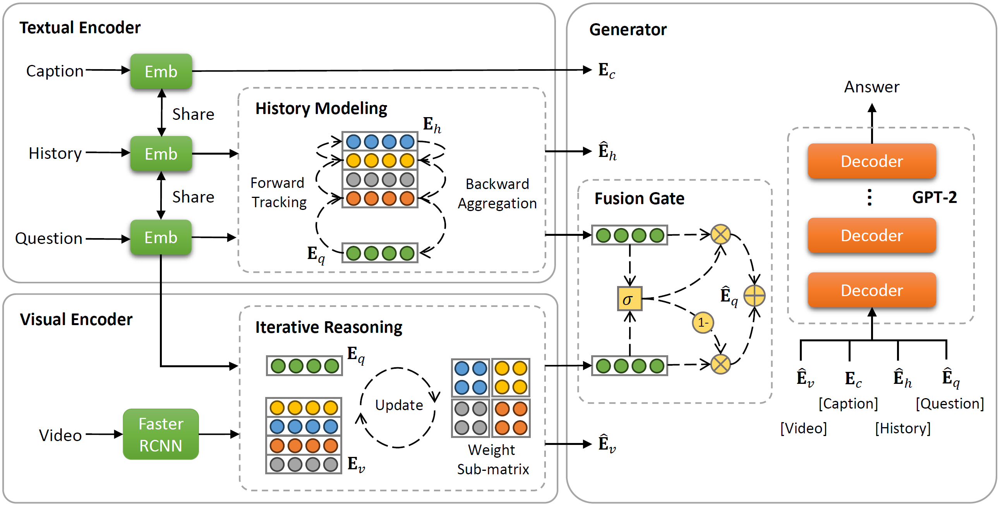

# ITR

Official Implementation of "Uncovering Hidden Connections: Iterative Tracking and Reasoning for Video-grounded Dialog".

## Abstract
In contrast to conventional visual question answering, video-grounded dialog necessitates a profound understanding of both dialog history and video content for accurate response generation. Despite commendable strides made by existing methodologies, they often grapple with the challenges of incrementally understanding intricate dialog histories and assimilating video information. In response to this gap, we present an iterative tracking and reasoning strategy that amalgamates a textual encoder, a visual encoder, and a generator. At its core, our textual encoder is fortified with a path tracking and aggregation mechanism, adept at gleaning nuances from dialog history that are pivotal to deciphering the posed questions. Concurrently, our visual encoder harnesses an iterative reasoning network, meticulously crafted to distill and emphasize critical visual markers from videos, enhancing the depth of visual comprehension. Culminating this enriched information, we employ the pre-trained GPT-2 model as our response generator, stitching together coherent and contextually apt answers. Our empirical assessments, conducted on two renowned datasets, testify to the prowess and adaptability of our proposed design.

## Data

You can visit this [link](https://drive.google.com/drive/folders/1SlZTySJAk_2tiMG5F8ivxCfOl_OWwd_Q) to get the text data, extracted video/audio feature, and evaluation tools.

If you need the raw video data, you can access this [website](https://prior.allenai.org/projects/charades). And the original videos of the test sets of the official Charades Challenge can be downloaded from the below updated links:  

https://ai2-public-datasets.s3-us-west-2.amazonaws.com/charades/Charades_vu17_test.tar [13GB]  
https://ai2-public-datasets.s3-us-west-2.amazonaws.com/charades/Charades_vu17_test_480.tar [2GB]

## Code

We will release the code used after the paper is received. 
